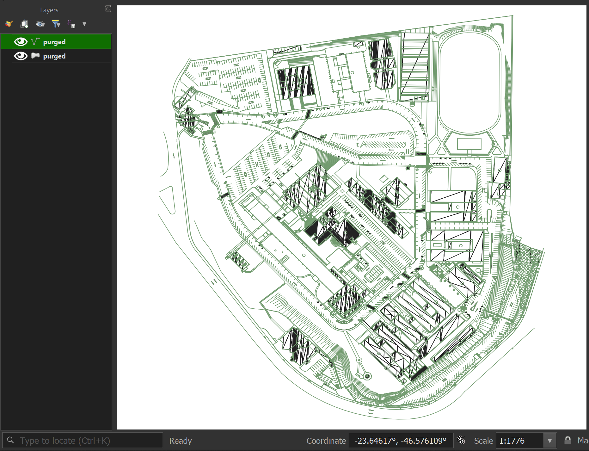

# KML Campus Blueprint Processor

## Project Overview

This Python utility transforms complex KML campus blueprint files into a lightweight, manageable format for digital mapping and path-finding applications.

## Main Project

This is a supporting utility for the [Mauá Map Project](https://github.com/ruymon/maua-map)

## Developer Experience & Performance Breakthrough

🚀 **Performance Transformation**

The original KML file was a developer's nightmare:

- Google Earth: Constant crashes
- QGIS: Unresponsive and failing to load

**Before Processing:**

- Google Earth: Would crash immediately
- QGIS: Hours of waiting, often resulting in failure to open

**After Processing:**

- Google Earth: Loads in ~3 seconds
- QGIS: Opens in ~3 seconds



### Why This Matters

This script isn't just about file size reduction—it's about **unblocking developer productivity**. What was once an impossible-to-handle geographic file became a nimble, manageable resource in minutes.

## Disclaimer

🚨 **Project-Specific Notice**:
This KML processing tool was developed specifically for my university campus mapping project. While it's not designed to be a generic KML manipulation library, it can serve as a helpful starting point for developers facing similar KML file complexity challenges.

## Project Structure

```
project_root/
│
├── .vscode/          # VS Code configuration (optional)
├── content/          # Original KML files
├── tmp/              # Temporary files generated during processing
├── final/            # Final processed KML files
│
├── main.py           # Orchestrator script
├── src/
│   ├── compressor.py # KML simplification script
│   └── purger.py     # Advanced KML purging script
│
├── LICENSE           # Project licensing
└── README.md         # Project documentation
```

## Workflow

The process is managed by `main.py`, which:

1. Reads the original KML file from the `content/` directory
2. Runs the compression process asynchronously
3. Generates intermediate files in the `tmp/` directory
4. Executes the purging process
5. Outputs the final processed file in the `final/` directory

### Main Script Example

```python
import src.compressor as c
import src.purger as p
import asyncio

original_file = 'campus_original.kml'
compressed_file_name = asyncio.run(c.compress_kml(original_file))
p.purge_kml(compressed_file_name)
```

## Background

During the development of a campus navigation system for my university, I encountered a significant challenge: the original campus blueprint KML files were excessively large and complex. These files contained numerous unnecessary elements that made them impractical for creating graph-based path-finding algorithms.

## Problem Statement

The initial KML files:

- Were too heavy to process efficiently
- Contained excessive metadata
- Included invisible and irrelevant geographic elements
- Had complex nested structures that complicated graph generation

## Solution

This Python script provides a multi-step KML file processing pipeline that:

1. Simplifies the original KML file
2. Removes unnecessary tags and metadata
3. Extracts only the essential geometric information
4. Prepares the file for easy graph node and edge generation

### Processing Steps

The project consists of two main processing scripts:

1. `compressor.py`:

   - Reads from `content/`
   - Removes Style tags
   - Extracts features from folders
   - Removes LookAt tags
   - Writes to `tmp/`

2. `purger.py`:
   - Reads from `tmp/`
   - Removes all name tags
   - Eliminates features with visibility set to 0
   - Purges point elements
   - Writes to `final/`

## Usage

```bash
# Run the main orchestration script
python main.py
```

## Technologies

- Python
- asyncio (for asynchronous file processing)
- lxml (XML parsing library)

## Potential Adaptations

While this tool was created for a specific use case, developers working with KML files might find it useful as:

- A reference implementation for KML file processing
- A starting point for custom KML manipulation scripts
- An example of systematic XML/KML file reduction techniques

## Lessons Learned

This project highlights the importance of data preprocessing in geospatial application development, demonstrating how critical it is to clean and simplify source data before building complex systems.

## Contributions

Feel free to fork and adapt this script for your specific KML processing needs. While it may require modifications, it provides a solid starting framework for KML file manipulation.
